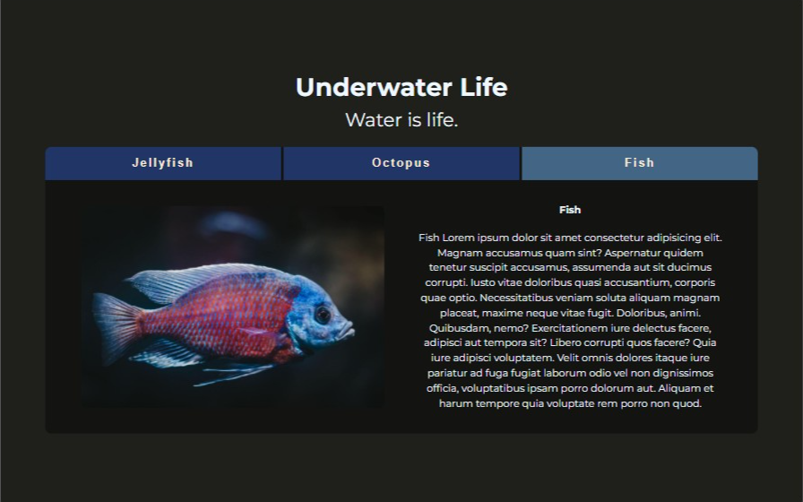

# Responsive Tabs

Responsive Tabs is a small Vanilla JS project to get better at JavaScript DOM manipulation.

## Tech Stack

- HTML, SCSS, JavaScript, Parcel

## Lessons Learned

- Autoprefixer is working.
- How to use data attribute.

## Project JS Goals

- Select tab buttons
- Add event listener to buttons
- On click, match button & tab panel id
- Display tab panel

## Live

You can check the project here. [▶ Responsive Tabs Live](https://responsive-tabs.netlify.app).
